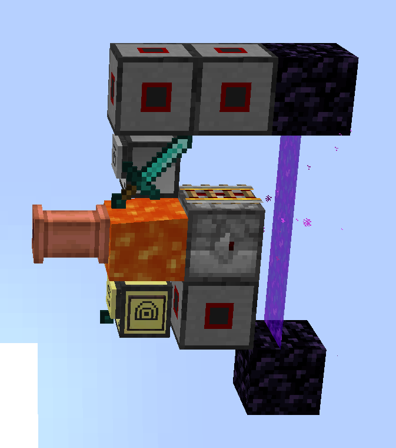
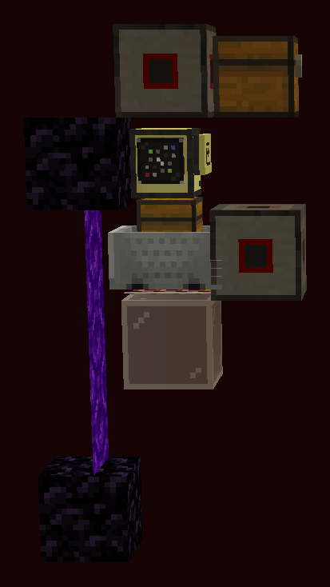

# Storage

An *instant* storage with a client-server model, with support for custom clients and wireless item transfer across the overworld and the Nether.

What does "instant" mean? As you write the search query in the client, 1 stack of each matching item is pulled into its inventory for preview. These previews are interactive: if you take out some of the items, the preview is immediately replenished. The inventory is updated *atomically within a single tick*, so it basically has the UX of a creative menu (assuming your server runs on good enough hardware and you don't have multiple clients competing over scarce items). This feature relies exclusively on CC:Tweaked and does not need any other supportive mods -- it's as vanilla as it gets for CC.

Wireless transfer is achieved with *ender storage* turtles. These don't have a preview, but can teleport to the storage and back thanks to the Turtlematic mod, resulting in a delay of 1-2 seconds. Unlike the main part of the storage, this one requires cooperation from multiple mods: Turtlematic for mimicking, warping, and the lava bucket peripheral, UnlimitedPeripheralWorks for hubs, Create for infinite lava sources, and Spectrum for a cool block to mimic (though the last part can be safely disabled).

Custom clients can use the server's comprehensive but small API to integrate the storage into farms or consumers.


## Design points

A single server can deposit items to and withdraw items from multiple clients. A lot of care is put into ensuring race conditions don't break anything. The server gracefully handles client disconnects, players interacting with the turtle while the server pulls from it, etc.

The storage requires a significant number of empty cells to operate due to the race condition avoidance algorithms. Prefer allocating 1 empty double chest per client. If the server runs out of storage, it crashes by assertion; sorry.

The server can quickly reindex the storage. The storage is reindexed automatically when peripherals are added or removed, though doing this while clients are interacting with the storage can crash the server, so pay attention to that.


## Setup

There are two parts to set up: the wired part and, optionally, the wireless part.

### Wired

The wired setup is very simple.

The server is a computer or a turtle running `server.lua` on startup. The clients are advanced turtles running `client.lua` on startup. They should be connected via a wired network, along with some chests. Upon booting, the server will recognize all connected chests as storage (blacklist is not supported). You might want to chunk-load the server and all clients if you're making a long-range network, since ComputerCraft seems to struggle with unloading computers safely. You're now all set.

The server also supports bottomless bundles from Spectrum as a storage. It cannot allocate items to bundles automatically, so you will need to pre-populate each bundle with 1 item as an indicator. This indicator is not considered in the item count, and the server will make sure not to lose it.

### Wireless

First, note that Turtlematic mod is extremely buggy, and you will need to install [vanutp's patches](https://github.com/vanutp-forks/Turtlematic/tree/vanutp-build) for the storage to work properly.

Install an ender modem somewhere on the wired network and reboot the server.

We're now going to set up *homes* for ender clients. These are locations in the world where the turtles will teleport to connect to the storage. Since turtles can break other turtles when warping, each ender client should have its own home. Homes have a specific 1-wide tileable layout, so you can place multiple homes next to each other. All homes should be chunk-loaded.

Since turtles cannot warp across dimensions, there are separate homes in the overworld and the Nether. The overworld home is connected directly to the wired network and an infinite source of lava, e.g. from Create: warping takes a lot of fuel, so lava is pretty much the only option. The Nether home is connected to the overworld home via a portal.

The overworld home looks like this:



- The turtle at the top is an *ender helper*, which executes tasks on behalf of the client when it's in the Nether.
- The pipe should be connected to a pump, refilling the lava source block.
- Make sure that all modems are enabled and connected to one wired network with the storage.
- The block to the right of lava is a dropper. Its orientation does not matter, and it serves exclusively as a non-flammable peripheral to keep the modem enabled when the client is away.
- The rail is oriented towards the portal; you will need to play around with rails to place multiple such rails side by side, so maybe build that part first.
- The turtle at the bottom is the ender storage turtle. When it's away, there will be flowing lava in its space, that's fine. You'll need to break the turtle for maintenance, so make sure you have a way of removing lava sources during that time.

The Nether home looks like this:



- The portal must be oriented in the same direction as the overworld home, such that rails of slices reliably connect to each other.
- The rail is oriented towards the portal. Cue the same issues.
- Make sure that all modems are enabled, and that the two rows of modems are connected into one wired network with a cable.
- The turtle is the ender storage turtle.
- The chest minecart is empty.
- The chest is empty and keeps the top modem enabled when the turtle is away.

The ender helper should run `ender_helper.lua` on startup and needs a diamond sword in an equipment slot.

The ender client should run `ender_client.lua` on startup and needs the following items:

- Mimic gadget.
- Netherite peripheralium hub.
- End automata core.
- Netherite end automata core.
- Ender modem.
- Speaker.
- Bucket.
- Diamond sword.

To set it up, place an advanced turtle into its overworld home, move all of the items above into its inventory, and run `ender_client.lua`. The turtle should install the upgrades, get fuel, configure the block it's in as its home, and then open a UI. Break the turtle and place it into its Nether home next. The turtle should record the location as its Nether home and open the UI again. The turtle can now be broken and used in both dimensions.


## Add-ons

The server exposes a simple protocol for implementing custom clients, so that you can request or deposit items programmatically. (Clients are always turtles.)

This repository includes one such add-on, which you can install on a turtle anywhere in the wired network if you need it: a [compacting turtle](compacter.lua) that crafts nuggets into ingots and ingots into blocks, among others.

If your use case calls for a custom client, consult the protocol description below and the example clients.


## Protocol

The rednet protocol used is `purple_storage`. The protocol supports automatic server discovery: the client should broadcast its messages until it receives a message from the server, at which point it knows what computer ID the server has and can send future messages directly.


### Index

The index API allows the client to keep track of which items are available in the storage.

When the client boots, it should send the following message:

```lua
{
    type = "request_index",
}
```

The server will then reply with a message of the following kind:

```lua
{
    type = "patch_index",
    items = { [key] = item, ... }
    reset = true,
    fullness = 0..100,
}
```

`items` is an associative array of items. The values are [the detailed information](https://tweaked.cc/reference/item_details.html) of items, where `count` represents the total number of items in the storage. `key` should be treated as a unique opaque key, but can be computed as `util.getItemKey(item)` if necessary.

`fullness` is an integer representing the percentage of the storage that is full.

`reset = true` indicates that `items` contains the complete index. Normally, when the server recognizes that the counts of certain items changed, it sends `patch_index` messages with `reset = false` and `items` containing only the difference from the previous index. `reset = true` is sent under three conditions: when the server boots, when it reindexes the storage, or when a client requests the index.

Clients are expected to keep local copies of the index, watch the rednet for `patch_index` messages, and patch the local copy from `items`, replacing it entirely if a patch with `reset = true` arrives:

```lua
index = {}
while true do
    local _, msg = rednet.receive("purple_storage")
    if msg.type == "patch_index" then
        if msg.reset then
            index = {}
        end
        for key, item in pairs(msg.items) do
            index[key] = item
        end
    end
end
```

Note that when all items of a given type are removed, the item will have `count = 0`. You may wish to ignore all such items.


### Ping

The client can send the following message to request a ping:

```lua
{
    type = "ping",
    id = anything,
}
```

The server will respond with:

```lua
{
    type = "pong",
    id = ...,
}
```

...where `id` will match the `id` in the request.

This API is useful as part of the timeout resolution step described later.


### Adjustment

The core of the protocol is *adjustment*. With `adjust_inventory`, a client can request the server to adjust its inventory to a given state. Excess items are deposited into the storage, while absent items are pulled from the storage.

```lua
{
    type = "adjust_inventory",
    client = ...,
    current_inventory = { [slot] = item, ... },
    goal_inventory = { [slot] = item, ... },
    preview = false/true,
}
```

`client` should be the wired name of the turtle and can be obtained by the client via [`modem.getNameLocal()`](https://tweaked.cc/peripheral/modem.html#v:getNameLocal).

`current_inventory` represents the state of the inventory that the turtle currently has. This is necessary because the server cannot query a turtle's inventory. It should be a table mapping a slot to [the detailed information](https://tweaked.cc/reference/item_details.html) of the item in that slot. This is similar to [`inventory.list()`](https://tweaked.cc/generic_peripheral/inventory.html#v:list), but contains detailed information instead of basic information. Here are two examples on how to get it:

```lua
local function loadInventorySync()
    local inventory = {}
    for slot = 1, 16 do
        inventory[slot] = turtle.getItemDetail(slot, true)
    end
    return inventory
end

local function loadInventoryAsync()
    return async.parMap(util.iota(16), function(slot)
        return turtle.getItemDetail(slot, true)
    end)
end
```

`goal_inventory` should have the same format. An absent entry for a slot means that the slot should be emptied. For example, setting `goal_inventory = {}` deposits the entire inventory.

`preview` indicates whether the pushed items should logically be still considered part of the storage, in that they are counted in `count` and can be forcibly pulled back by the server if necessary. `preview = true` makes the items available to other clients, while `preview = false` guarantees that the server will not touch the client's inventory.

When the server finishes adjustment, it sends the following message:

```lua
{
    type = "inventory_adjusted",
    new_inventory = { [slot] = item, ... },
    needs_retry = false/true,
}
```

`new_inventory` contains the state of the inventory the server believes the client now has in the same format as `goal_inventory`. There are multiple subtle issues here:

1. `new_inventory` may not be equal to `goal_inventory` if some requests could not be satisfied because the goal `count` was higher than the number of items present. `new_inventory` may have a smaller `count` or even `nil` in that slot. If the same item is pulled into multiple slots, no guarantees are offered as to which slots will be populated. You should always be prepared to deal with this, since another client can pull items from the storage concurrently.

2. `new_inventory` may not be equal to the actual inventory as seen by the client if a user changes the client's inventory concurrently. This is only an issue if you expect the client's inventory to be interacted with by anyone except the client.

3. Pulling from other clients' previews is an edge case. First, the server never pulls from previews for previews, so in that case you can get a smaller `count` even if `count` is within the number of items in the storage. Second, pulling from previews can fail if the clients the storage tried to pull items from are disconnected or a player took items away concurrently. This condition is signaled by `needs_retry`: if it's `true`, the server realized its information about previews is outdated and the request needs to be retried (with new `current_inventory`) to be completed. This design allows `goal_inventory` to be updated on the second invocation if goals change, making event-driven UI more responsive.

#### Timeout handling

Note that if you want to detect the server being shut down, crashing, or being disconnected from the network, you cannot just slap a timeout on receiving `inventory_adjusted`. It is *incorrect* to send `adjust_inventory` after the previous `adjust_inventory` request timed out.

Specifically, while `inventory_adjusted` typically arrives within a few ticks after `adjust_inventory`, it can be delayed under lag. If the server eventually handles the first request, `current_inventory` of the second request will be outdated, causing the server to produce an unexpected inventory and making the client send new requests that further exacerbate the problem. This can result in infinite loops and non-convergent behavior even with otherwise reasonable clients.

The correct recovery procedure after timeout is to send a ping and block until a pong with the same ID arrives. Pings are safe to timeout and resend. Since the server processes all messages sequentially, by the time a pong arrives, all previous adjustments must have been completed, and so it is safe to send `adjust_inventory` again.


### Triggering readjustment

The general shape of automatic readjustment is like this:

```lua
local readjust = async.newNotifyOne()
async.spawn(function()
    while true do
        rednet.send(server_id, {
            type = "adjust_inventory",
            client = ...,
            current_inventory = loadInventory(),
            goal_inventory = goal_inventory,
            preview = ...,
        }, "purple_storage")
        -- not shown: wait for `inventory_adjustment` to arrive here
        readjust.wait()
    end
end)
```

Readjustment should be serialized, with a request only being sent after the previous one completes. A "notify" primitive implements the right semantics. It also allows readjustment to be triggered from multiple sources, which we now go over one by one.

#### Inventory changes

This is only necessary if you want a user to interact with your client's inventory.

To recognize when a user adds or removes items from its inventory, the client can listen to the `turtle_inventory` event. Since this event can arrive during adjustment (either due to the user concurrently updating the inventory, or due to the server's own actions), you need to wait until adjustment completes before sending `adjust_inventory` again:

```lua
async.subscribe("turtle_inventory", readjust.notifyOne)
```

Note that if `turtle_inventory` arrives for the second time due to the server's actions, the server will have nothing to do on this next adjustment request, and so `turtle_inventory` won't arrive for the third time and trigger an infinite loop.

#### Index updates

You may want to trigger readjustment if new items or more items of a given type arrive in the index.

Note that it is *incorrect* to trigger readjustment on every index change. Specifically, the server sends index updates even if *no item counts are changed* to propagate `fullness` updates. Readjustment should only be triggered if `items` is non-empty:

```lua
if next(msg.items) then
    readjust.notifyOne()
end
```

Note also that the server can send an index update for an item even if `count` stays the same, and readjustment *should* often be triggered under this condition. This situation occurs if the server pulls a preview from the client -- this does not affect the count of the items in the storage, since a preview is logically considered part of the storage, but it *does* allow more items to be pulled if you're pulling for preview.

#### Inventory requests

This is only necessary if you pull for preview.

When the server reboots or reindexes the storage, it cannot automatically index previews in your client's inventory, since turtles don't implement the inventory API. Instead, the server sends a message asking clients to submit their inventories:

```lua
{
    type = "request_inventory",
}
```

The inventories should be submitted as the `current_inventory` field of the `adjust_inventory` message, making the handling of this message trivial:

```lua
if msg.type == "request_inventory" then
    readjust.notifyOne()
end
```


### Connectivity checks

The server can notify a client when the client's inventory is disconnected from the wired network. This can occur by accident if a user right-clicks the wired modem and acts as a sanity check. This is necessary because a turtle cannot detect this condition by itself except by polling.

Specifically, each time a turtle is connected or disconnected, the server broadcasts the following message:

```lua
{
    type = "peripherals_changed",
}
```

Clients can then call `modem.getNameLocal()` to verify if they are still connected, depending on whether the function returns a string or `nil`.
